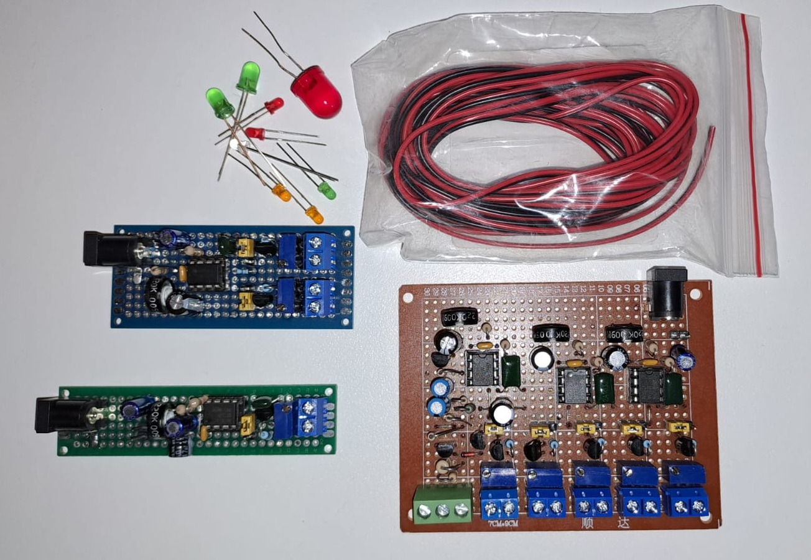
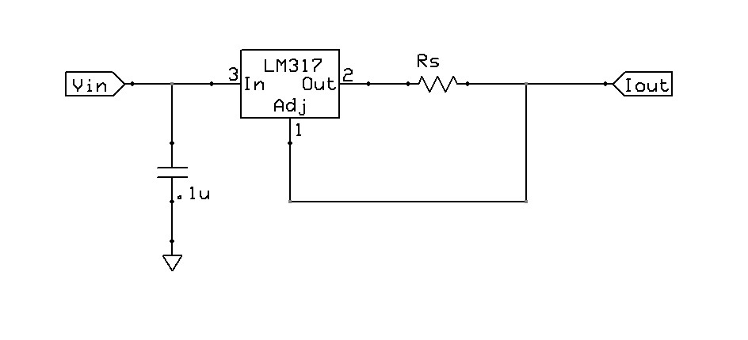
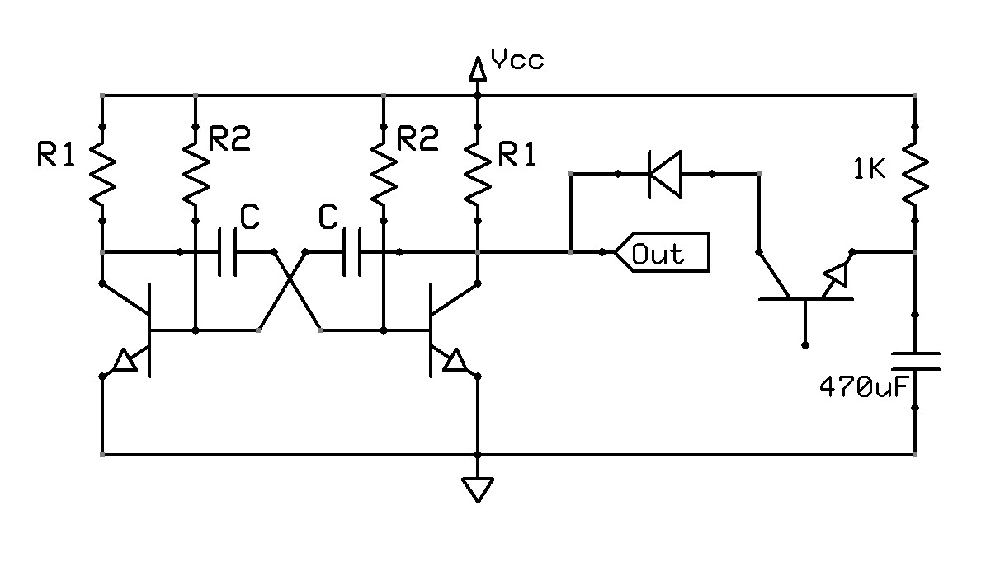
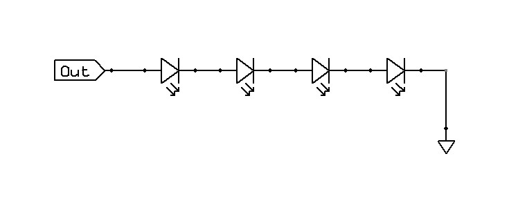

# *Keep It Simple*

# Modular Presepe Lights
A set of simple modular circuits for the lighting of the presepe.
 
The idea is to make a very simple lights controller, with a modular approach depending on the needs, to drive low-current (and short) LED strings, with an external supply voltage between 12 and 15 VDC.

The concept behind *Keep-It-Simple* is to build simple solutions using only a few general-purpose, easy-to-manage components, without MCUs or programmable devices.

## Modules

### LED Driver Module
Is the only mandatory module, implemented with a LM317 configured as a constant current source.
This simple configuration is capable to drive a LED string that has a drop voltage of less than $Vin$ minus a few volts.

The output current of this circuit is:

$$ I_{out} = 1.25/R_{s} $$

### Intermittence Module
A variable frequency astable multivibrator that acts as intermittence, implemented with a 555 timer.

A rectangular voltage signal of approximately $Vout = Vcc-1.5V$ is obtained as output.
 
Circuit timing equations are:

$$ period = 0,69*(R_{1} + 2R_{2})*C $$

$$ dutycycle = \large\frac{R_{1} + R_{2}}{R_{1} + 2R_{2}} $$

### Firelight Module
A fixed frequency astable multivibrator "disturbed" by a simple relaxaction oscillator, to emulate the irregular tremolo of firelight.

### Starlight Module
The same circuit of the firelight module, but with a slightly faster frequency.

### LED string Module
A series of max 4 or 5 small-current LEDs. The maximum drop voltage must be less than $V_{out}$ minus a few volts.

Typical (but very very indicative) LED voltage drop, based on color, are:

$$ red \sim 1.6 - 2.0 $$

$$ orange \sim 2.0 $$

$$ yellow \sim 2.0 $$

$$ green \sim 1.9 - 4.0 $$

$$ blu \sim 2.5 - 3.7 $$

$$ white \sim 3.2 - 4.0 $$

## Boards
- [Tiny Board](boards/tiny-board) implements a single line configurable intermittence board.
- [Small Board](boards/small-board) implements a configurable board with 1 intermittence module capable of drive 2 LED-strings.
- [Medium Board](boards/medium-board) implements a configurable board with 3 intermittence modules capable of drive 5 LED-strings, plus a firelight set.

## About
Author : Alessandro Fraschetti (mail: [gos95@gommagomma.net](mailto:gos95@gommagomma.net))

## Licence
The [MIT license](LICENSE) posted in the main repository directory is applied to all the stuff.
You are free to use them for any purpose, just try to give credit in the documentation of your project.