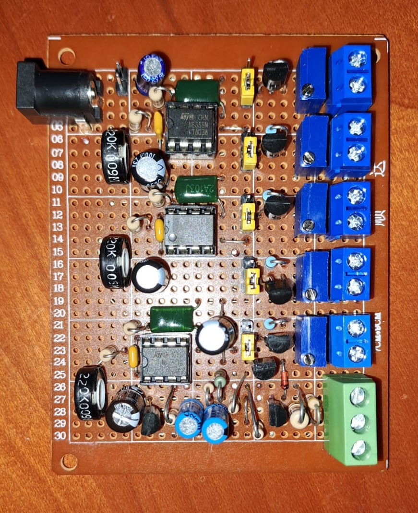
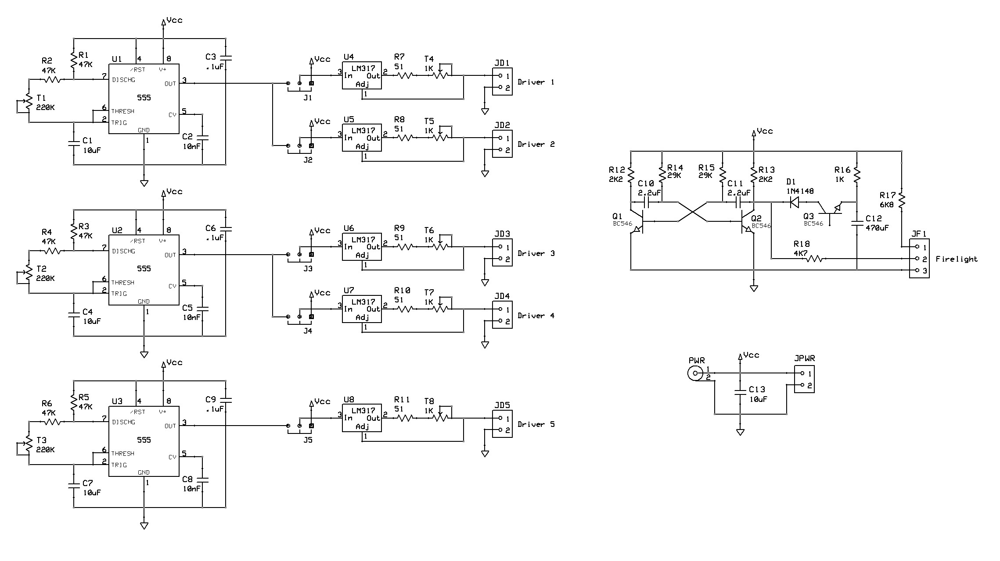
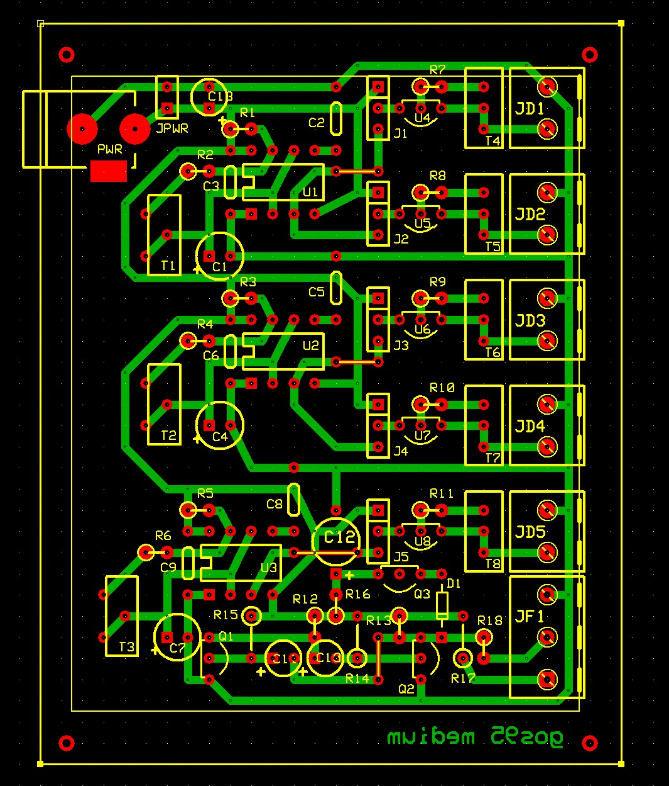

# *Medium* Board
Configurable board with 3 intermittence modules capable of drive 5 LED-strings, plus a firelight set.
The light intensity can be varied via trimmers T5-T10,
and the period of intermittence can be varied using the T1-T4 trimmers, between about 5 and 20 seconds. 
The firelight set consists of a fixed LED output and a tremolo LED output (red+orange?).

## Schematic

## PCB Layout

## Bill of Materials
- [x] paperboard 7x10cm
- [x] 4 x IC 555 timer
- [x] 6 x IC LM317 3-terminal adjustable regulator
- [x] 3 x Transistor BJT NPN for low current
- [x] diode for small signal
- [x] 8 x 47Kohm resistors 1/4 watt
- [x] 2 x 29Kohm resistors 1/4 watt
- [x] 6.8Kohm resistors 1/4 watt
- [x] 4.7Kohm resistors 1/4 watt
- [x] 2 x 2.2Kohm resistors 1/4 watt
- [x] 1Kohm resistors 1/4 watt
- [x] 6 x 51ohm resistors 1/4 watt
- [x] 6 x 1Kohm trimmers
- [x] 4 x 220Kohm trimmers
- [x] 470uF electrolytic capacitors 25V
- [x] 4 x 10uF electrolytic capacitors 25V
- [x] 2 x 2.2uF electrolytic capacitors 25V
- [x] 4 x 10nF capacitors 25V
- [x] DC male power connector 2.1mm
- [x] 6 x 2-pin screw terminal block 2.5mm
- [x] 3-pin screw terminal block 2.5mm

