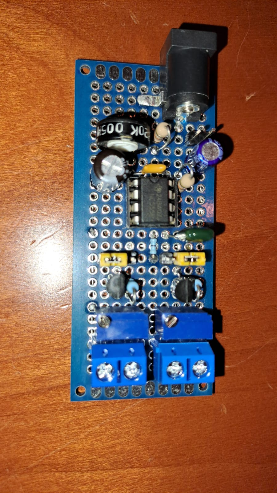
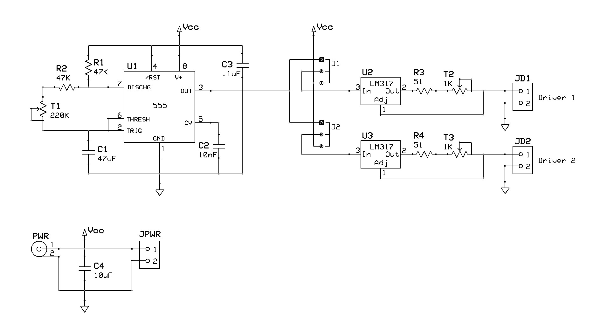
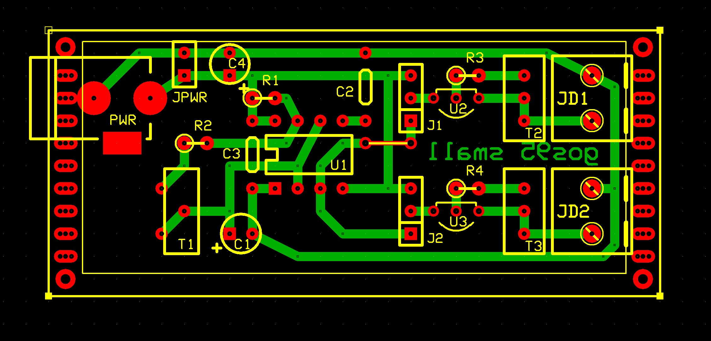

# *Small* Board
Configurable board with 1 intermittence module capable of drive 2 LED-strings.
The light intensity can be varied via trimmers T2/T3,
and the period of intermittence can be varied using the T1 trimmer, between about 5 and 20 seconds.
The intermittence module can be plugget to none, one or both the drivers via J1/J2 jumpers.

## Schematic

## PCB Layout

## Bill of Materials
- [x] paperboard 4x6cm
- [x] 1 x IC 555 timer
- [x] 2 x IC LM317 3-terminal adjustable regulator
- [x] 2 x 47Kohm resistors 1/4 watt
- [x] 2 x 51ohm resistors 1/4 watt
- [x] 2 x 1Kohm trimmers
- [x] 1 x 220Kohm trimmers
- [x] 2 x 10uF electrolytic capacitors 25V
- [x] 1 x 100nF capacitors 25V
- [x] 1 x 10nF capacitors 25V
- [x] DC male power connector 2.1mm
- [x] 2-pin screw terminal block 2.5mm
- [x] 2-pin header
