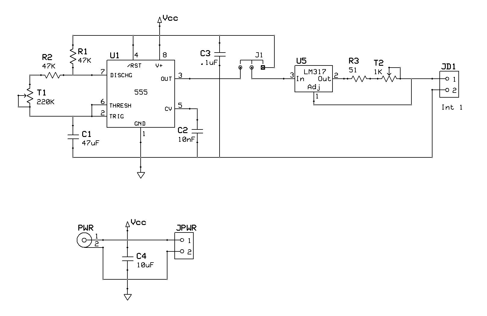
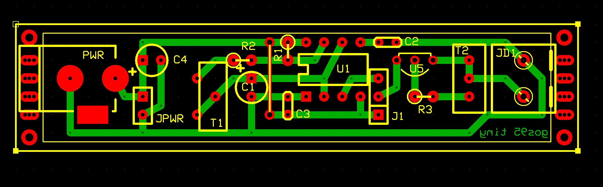

# *Tiny* Board
Single line intermittence board.
The light intensity can be varied via trimmer T2,
and the period of intermittence can be varied using T1 trimmer, between about 5 and 20 seconds.
The intermittence can be enable or disable by J1.

## Schematic

## PCB Layout

## Bill of Materials
- [x] paperboard 2x8cm
- [x] IC 555 timer
- [x] IC LM317 3-terminal adjustable regulator
- [x] 2 x 47Kohm resistors 1/4 watt
- [x] 51ohm resistors 1/4 watt
- [x] 1Kohm trimmer
- [x] 220Kohm trimmer
- [x] 2 x 10uF electrolytic capacitors 25V
- [x] 100nF capacitors 25V
- [x] 10nF capacitors 25V
- [x] DC male power connector 2.1mm
- [x] 2-pin screw terminal block 5mm
- [x] 2-pin header

